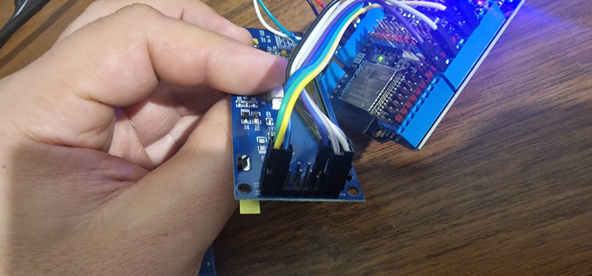

# 🎮 ESP32 Breakout Game

An engaging breakout-style game implementation using ESP32 microcontroller with a high-resolution SSD1322 OLED display and rotary encoder control.

## 🎯 Game Description

**Breakout Challenge** - A classic arcade-style game where you control a paddle to keep a bouncing ball in play. The ball moves around the screen, bouncing off walls and your paddle. Your goal is to prevent the ball from falling off the bottom of the screen by positioning your paddle correctly using the rotary encoder. As you play, the game gradually increases in speed, making it more challenging!

### Game Features
- **Dynamic Speed**: Game speed increases progressively for added challenge
- **Smooth Controls**: Precise paddle control using rotary encoder
- **Real-time Display**: Live position, encoder value, and speed indicators
- **Visual Effects**: Multi-layered circle animation for the ball
- **Game Over Screen**: Clear end-game indication

## 🛠️ Technologies Used

### Hardware Components

#### ESP32 Development Board
- **Microcontroller**: ESP32 (dual-core, WiFi & Bluetooth capable)
- **Operating Voltage**: 3.3V
- **GPIO Pins**: Multiple digital I/O pins for peripheral connections

#### SSD1322 OLED Display
- **Resolution**: 256×64 pixels
- **Technology**: Grayscale OLED (16 levels)
- **Interface**: SPI 4-wire communication
- **Viewing Angle**: >160°
- **Contrast**: High contrast ratio for excellent visibility
- **Power Consumption**: Low power consumption

#### Rotary Encoder
- **Type**: Incremental rotary encoder
- **Output**: Quadrature signals (A & B channels)
- **Resolution**: Configurable via software scaling
- **Function**: Paddle position control

### Software Libraries

- **Adafruit_GFX**: Graphics library for drawing primitives
- **SSD1322_for_Adafruit_GFX**: Specific driver for SSD1322 display
- **ESP32Encoder**: Hardware-optimized encoder reading library
- **SPI**: Hardware SPI communication

## 📋 Pin Configuration

### SSD1322 Display Connections (SPI 4-wire)
```
ESP32 Pin    │ SSD1322 Pin │ Function
─────────────┼─────────────┼──────────────────
GPIO 23      │ SDA (MOSI)  │ Serial Data
GPIO 18      │ SCL (SCLK)  │ Serial Clock
GPIO 2       │ D/C         │ Data/Command
GPIO 4       │ RST         │ Reset
GPIO 5       │ CS          │ Chip Select
3.3V         │ VCC         │ Power Supply
GND          │ GND         │ Ground
```

### Rotary Encoder Connections
```
ESP32 Pin    │ Encoder Pin │ Function
─────────────┼─────────────┼──────────────────
GPIO 32      │ A           │ Channel A
GPIO 33      │ B           │ Channel B
3.3V         │ VCC         │ Power Supply
GND          │ GND         │ Ground
```

## 🔌 Wiring Diagram

```
         ESP32                    SSD1322 Display
    ┌─────────────┐              ┌─────────────────┐
    │         3V3 │──────────────│ VCC             │
    │         GND │──────────────│ GND             │
    │      GPIO23 │──────────────│ SDA (MOSI)      │
    │      GPIO18 │──────────────│ SCL (SCLK)      │
    │       GPIO2 │──────────────│ D/C             │
    │       GPIO4 │──────────────│ RST             │
    │       GPIO5 │──────────────│ CS              │
    │             │              └─────────────────┘
    │             │
    │             │              Rotary Encoder
    │             │              ┌─────────────────┐
    │         3V3 │──────────────│ VCC             │
    │         GND │──────────────│ GND             │
    │      GPIO32 │──────────────│ A               │
    │      GPIO33 │──────────────│ B               │
    └─────────────┘              └─────────────────┘
```

## 🚀 Getting Started

### Prerequisites
- PlatformIO IDE or Arduino IDE
- ESP32 development board
- SSD1322 256×64 OLED display
- Rotary encoder
- Jumper wires
- Breadboard (optional)

### Installation

1. **Clone the repository**:
   ```bash
   git clone https://github.com/pprzyby2/ESP32_GAME.git
   cd ESP32_GAME
   ```

2. **Install dependencies**:
   The required libraries are automatically managed by PlatformIO based on the `platformio.ini` configuration.

3. **Wire the components** according to the pin configuration above.

4. **Upload the code**:
   - Connect your ESP32 to your computer via USB
   - Build and upload using PlatformIO

### Library Dependencies
```ini
lib_deps = 
    adafruit/Adafruit GFX Library
    olikraus/SSD1322 for Adafruit GFX
    madhephaestus/ESP32Encoder
```

## 🎮 How to Play

1. **Power on** the ESP32 - the display will show a welcome message
2. **Use the rotary encoder** to move the paddle left and right
3. **Keep the ball in play** by positioning the paddle to catch it
4. **Watch the speed increase** as the game progresses
5. **Game over** occurs when the ball falls below the paddle

### Game Controls
- **Rotary Encoder**: Rotate to move paddle left/right
- **Automatic**: Ball movement and speed progression

## 📊 Game Mechanics

- **Paddle Range**: 0-216 pixels (with 40-pixel wide paddle)
- **Ball Physics**: Bounces off walls and paddle
- **Speed Scaling**: Decreases delay every 100 loops (increases difficulty)
- **Encoder Scaling**: 4:1 ratio for smooth control
- **Collision Detection**: Ball-paddle intersection detection

## 🔧 Customization

You can modify various game parameters in the code:

```cpp
const int encScale = 4;        // Encoder sensitivity
int speed = 30;                // Initial game speed (lower = faster)
// Paddle size: 40 pixels wide
// Display bounds: 256×64 pixels
```

## 📸 Screenshots


*Game in action showing the ball, paddle, and real-time stats*


*Game over screen display*



*ESP32 connected to SSD1322 OLED display and rotary encoder*
*Game in action showing the ball, paddle, and real-time stats*

## 🤝 Contributing

Contributions are welcome! Feel free to:
- Report bugs
- Suggest new features
- Submit pull requests
- Improve documentation

## 📄 License

This project is licensed under the MIT License - see the [LICENSE](LICENSE) file for details.

## 🙏 Acknowledgments

- Adafruit for the excellent graphics libraries
- ESP32 community for encoder libraries
- PlatformIO for the development environment

---

**Enjoy the game!** 🎮✨
